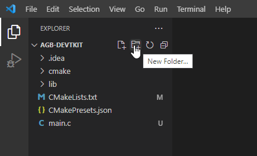
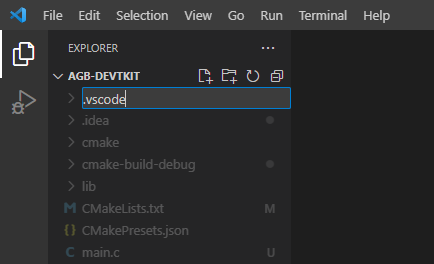
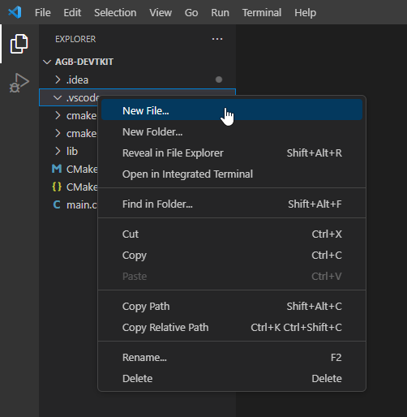
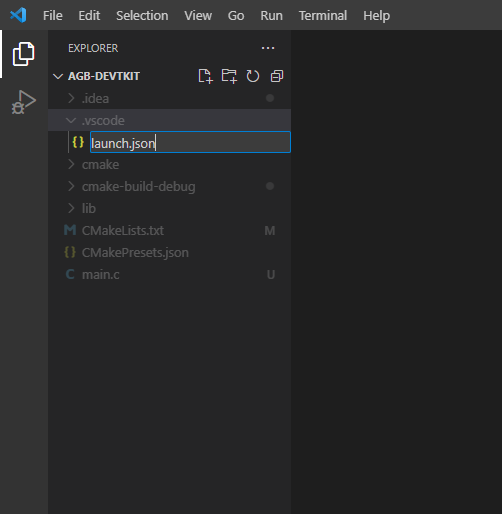
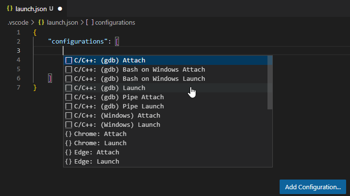
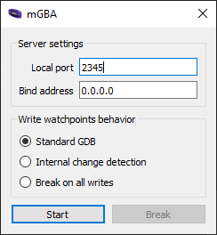
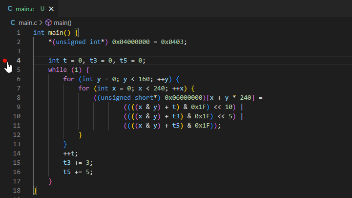
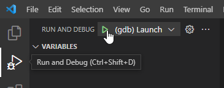
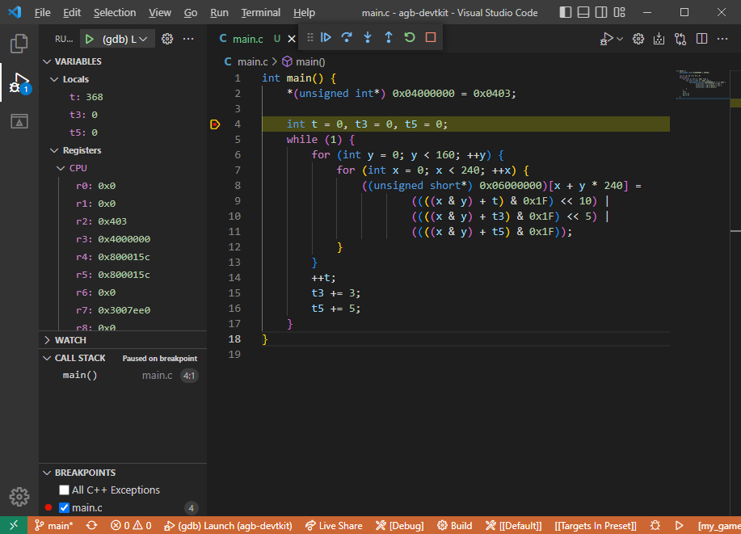

The incredible [mGBA](https://mgba.io) emulator comes with its own [gdbserver](https://en.wikipedia.org/wiki/Gdbserver), allowing us to connect the [GNU Debugger (GDB)](https://en.wikipedia.org/wiki/GNU_Debugger) to our Game Boy Advance programs and inspect the state of the emulated machine.

When combined with a GDB compatible IDE, such as Visual Studio Code, it becomes possible to write code for the Game Boy Advance, drop a breakpoint in that code, run mGBA, and step-by-step execute code, inspecting the state of registers, memory, and variables.

If you just want an end result `launch.json` to copy-paste and modify then [see the final launch.json](#the-final-launch.json).

---

This is a tutorial for setting up the GDB debugger for Visual Studio Code.

[Visual Studio Code](https://code.visualstudio.com) is a free editor available for Windows, Linux, and macOS.

I won't cover setting up GBA development for Visual Studio Code, just setting up debugging.

# Create "launch.json"

If you don't already have a `.vscode` directory, go ahead and make that.

 

Right-click the `.vscode` directory and create a new file called `launch.json`.

 

Open the `launch.json` file, and then click the `Add Configuration button` at the lower left. `Select C/C++: (gdb) Launch` to create a skeleton launch configuration for us to fill in.



The skeleton configuration should look like this:

```json
{
    "configurations": [
        {
            "name": "(gdb) Launch",
            "type": "cppdbg",
            "request": "launch",
            "program": "enter program name, for example ${workspaceFolder}/a.exe",
            "args": [],
            "stopAtEntry": false,
            "cwd": "${fileDirname}",
            "environment": [],
            "externalConsole": false,
            "MIMode": "gdb",
            "miDebuggerPath": "/path/to/gdb",
            "setupCommands": [
                {
                    "description": "Enable pretty-printing for gdb",
                    "text": "-enable-pretty-printing",
                    "ignoreFailures": true
                },
                {
                    "description": "Set Disassembly Flavor to Intel",
                    "text": "-gdb-set disassembly-flavor intel",
                    "ignoreFailures": true
                }
            ]
        }
    ]
}
```

## "targetArchitecture"

By default, VSCode assumes you are going to be debugging the architecture that you’re developing from. The GBA is an Arm architecture device, so we can add in a `"targetArchitecture"` field and set that to `"arm"`.

```json
"targetArchitecture": "arm"
```

In my JSON I've put this under the `"request"` field:

```json
"request": "launch",
"targetArchitecture": "arm",
```

## "program"

The program is our built Game Boy Advance `.elf` file that we want to debug. Note that this must be a `.elf` file, and **not** the `objcopy`'d .gba file!

```json
"program": "enter program name, for example ${workspaceFolder}/a.exe"
```

The `${workspaceFolder}` VSCode variable can be used to reference your project directory, so if your program is called `my-game.elf` and is built in the project directory we can enter this as our `"program"` value:

```json
"program": "${workspaceFolder}/my-game.elf"
```

I use [CMake](https://cmake.org) in my setup, so my `.elf` file is built into a build directory. With CMake I can reference the built `.elf` file directly with the variable `${command:cmake.launchTargetPath}`.

```json
"program": "${command:cmake.launchTargetPath}"
```

## "miDebuggerServerAddress"

By default, mGBA's gdbserver listens on port `2345`.



Add the field `"miDebuggerServerAddress"` with the value `"localhost:2345"` to match mGBA's default.

```json
"miDebuggerServerAddress": "localhost:2345"
```

In my JSON I put this under the `"MIMode"` field:

```json
"MIMode": "gdb",
"miDebuggerServerAddress": "localhost:2345",
```

## "miDebuggerPath" and "setupCommands"

This is the path of mGBA itself, as well as the commands for executing it.

```json
"miDebuggerPath": "/path/to/gdb",
"setupCommands": [
    {
        "description": "Enable pretty-printing for gdb",
        "text": "-enable-pretty-printing",
        "ignoreFailures": true
    },
    {
        "description": "Set Disassembly Flavor to Intel",
        "text": "-gdb-set disassembly-flavor intel",
        "ignoreFailures": true
    }
]
```

This path will depend on what platform you are using, as well as where you've installed mGBA, so we can split this into Windows, Linux, and macOS options.

Delete the upper level `"miDebuggerPath"` and `"setupCommands"` fields, and replace them with `"windows"`, `"linux"`, and `"osx"` fields as shown below.

```json
"windows": {
    "miDebuggerPath": "",
    "setupCommands": []
},
"linux": {
    "miDebuggerPath": "",
    "setupCommands": []
},
"osx": {
    "miDebuggerPath": "",
    "setupCommands": []
}
```

Set the `"miDebuggerPath"` to where you have `arm-none-eabi-gdb` installed on your system.

If you are using [devkitARM with devkitPro](https://devkitpro.org) this debugger can be located in `devkitpro/devkitARM/bin/arm-none-eabi-gdb`, and if you have the `DEVKITARM` environment variable set you can use `${env:DEVKITARM}/bin/arm-none-eabi-gdb` (with an added `.exe` on Windows).

```json
"windows": {
    "miDebuggerPath": "${env:DEVKITARM}/bin/arm-none-eabi-gdb.exe",
    "setupCommands": []
},
"linux": {
    "miDebuggerPath": "${env:DEVKITARM}/bin/arm-none-eabi-gdb",
    "setupCommands": []
},
"osx": {
    "miDebuggerPath": "${env:DEVKITARM}/bin/arm-none-eabi-gdb",
    "setupCommands": []
}
```

If you are not using devkitARM then you'll need to adjust accordingly, for example I also use the [Arm GNU Toolchain](https://developer.arm.com/Tools%20and%20Software/GNU%20Toolchain):

```json
"windows": {
    "miDebuggerPath": "${env:ProgramFiles(x86)}/Arm GNU Toolchain arm-none-eabi/12.2 rel1/bin/arm-none-eabi-gdb.exe",
    "setupCommands": []
},
"linux": {
    "miDebuggerPath": "arm-none-eabi-gdb",
    "setupCommands": []
},
"osx": {
    "miDebuggerPath": "/Applications/ArmGNUToolchain/12.2 rel1/arm-none-eabi/bin/arm-none-eabi-gdb",
    "setupCommands": []
}
```

As for the `"setupCommands"`, these will also be platfrom specific.

Due to a quirk in how mGBA runs and how VSCode waits for gdb-servers to connect, we have to launch mGBA as its own process so there’s no deadlock between it and VSCode.

On Windows this can be done with the start /b "" command. On Linux and macOS you need only to end your shell command with the ampersand symbol &, however on macOS we can open the mGBA app in its own process with the open -a command.

mGBA uses the -g option to start its gdb-server, so we need to include that.

```json
"windows": {
    "miDebuggerPath": "${env:DEVKITARM}/bin/arm-none-eabi-gdb.exe",
    "setupCommands": [
        {
            "text": "shell start /b \"\" \"${env:ProgramFiles}/mGBA/mGBA.exe\" -g \"${workspaceFolder}/my-game.elf\""
        }
    ]
},
"linux": {
    "miDebuggerPath": "${env:DEVKITARM}/bin/arm-none-eabi-gdb",
    "setupCommands": [
        {
            "text": "shell \"mgba-qt\" -g \"${workspaceFolder}/my-game.elf\" &"
        }
    ]
},
"osx": {
    "miDebuggerPath": "${env:DEVKITARM}/bin/arm-none-eabi-gdb",
    "setupCommands": [
        {
            "text": "shell open -a mGBA --args -g \"${workspaceFolder}/my-game.elf\""
        }
    ]
}
```

On my Windows installation where I am using CMake I have mGBA installed in `E:\mGBA\mGBA.exe`, so my JSON file looks like this:

```json
"windows": {
    "miDebuggerPath": "${env:ProgramFiles(x86)}/Arm GNU Toolchain arm-none-eabi/12.2 rel1/bin/arm-none-eabi-gdb.exe",
    "setupCommands": [
        {
            "text": "shell start /b \"\" \"E:/mGBA/mGBA.exe\" -g \"${command:cmake.launchTargetPath}\""
        }
    ]
},
"linux": {
    "miDebuggerPath": "arm-none-eabi-gdb",
    "setupCommands": [
        {
            "text": "shell \"mgba-qt\" -g \"${command:cmake.launchTargetPath}\" &"
        }
    ]
},
"osx": {
    "miDebuggerPath": "/Applications/ArmGNUToolchain/12.2 rel1/arm-none-eabi/bin/arm-none-eabi-gdb",
    "setupCommands": [
        {
            "text": "shell open -a mGBA --args -g \"${command:cmake.launchTargetPath}\""
        }
    ]
}
```

Again, inspect these settings closely and make sure the path match to where you have `arm-none-eabi-gdb` and `mGBA` installed.

If you only use Linux, or macOS, or Windows, then you can delete the fields for the other platforms.

## The final launch.json

```json
{
    "configurations": [
        {
            "name": "(gdb) Launch",
            "type": "cppdbg",
            "request": "launch",
            "targetArchitecture": "arm",
            "program": "${workspaceFolder}/my-game.elf",
            "args": [],
            "stopAtEntry": false,
            "cwd": "${fileDirname}",
            "environment": [],
            "externalConsole": false,
            "MIMode": "gdb",
            "miDebuggerServerAddress": "localhost:2345",
            "windows": {
                "miDebuggerPath": "${env:DEVKITARM}/bin/arm-none-eabi-gdb.exe",
                "setupCommands": [
                    {
                        "text": "shell start /b \"\" \"${env:ProgramFiles}/mGBA/mGBA.exe\" -g \"${workspaceFolder}/my-game.elf\""
                    }
                ]
            },
            "linux": {
                "miDebuggerPath": "${env:DEVKITARM}/bin/arm-none-eabi-gdb",
                "setupCommands": [
                    {
                        "text": "shell \"mgba-qt\" -g \"${workspaceFolder}/my-game.elf\" &"
                    }
                ]
            },
            "osx": {
                "miDebuggerPath": "${env:DEVKITARM}/bin/arm-none-eabi-gdb",
                "setupCommands": [
                    {
                        "text": "shell open -a mGBA --args -g \"${workspaceFolder}/my-game.elf\""
                    }
                ]
            }
        }
    ]
}
```

For my CMake situation my launch.json file looks like this:

```json
{
    "configurations": [
        {
            "name": "(gdb) Launch",
            "type": "cppdbg",
            "request": "launch",
            "targetArchitecture": "arm",
            "program": "${command:cmake.launchTargetPath}",
            "args": [],
            "stopAtEntry": false,
            "cwd": "${fileDirname}",
            "environment": [],
            "externalConsole": false,
            "MIMode": "gdb",
            "miDebuggerServerAddress": "localhost:2345",
            "windows": {
                "miDebuggerPath": "${env:ProgramFiles(x86)}/Arm GNU Toolchain arm-none-eabi/12.2 rel1/bin/arm-none-eabi-gdb.exe",
                "setupCommands": [
                    {
                        "text": "shell start /b \"\" \"E:/mGBA/mGBA.exe\" -g \"${command:cmake.launchTargetFilename}\""
                    }
                ]
            },
            "linux": {
                "miDebuggerPath": "arm-none-eabi-gdb",
                "setupCommands": [
                    {
                        "text": "shell \"mgba-qt\" -g \"${command:cmake.launchTargetFilename}\" &"
                    }
                ]
            },
            "osx": {
                "miDebuggerPath": "/Applications/ArmGNUToolchain/12.2 rel1/arm-none-eabi/bin/arm-none-eabi-gdb",
                "setupCommands": [
                    {
                        "text": "shell open -a mGBA --args -g \"${command:cmake.launchTargetFilename}\""
                    }
                ]
            }
        }
    ]
}
```

## Drop a breakpoint

At this point we can try out dropping a breakpoint and debugging.

So click in the margin of the line you want to debug to set a breakpoint.



To start debugging in Visual Studio Code, open the `Run and Debug` view, then click the green play-button of `(gdb) Launch`.



And if everything went right, mGBA should open up, begin executing your `.elf`, and then when your breakpoint is hit Visual Studio Code should display the debugging view.



Notice how we can view local variables, CPU registers, and even the call stack. Very cool.
